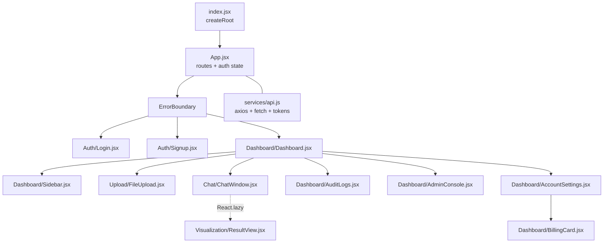
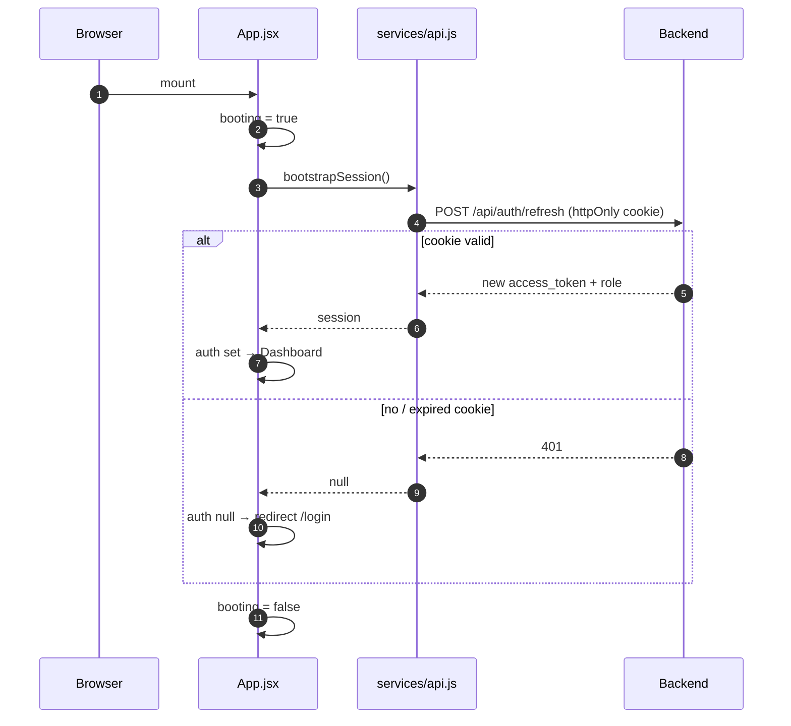
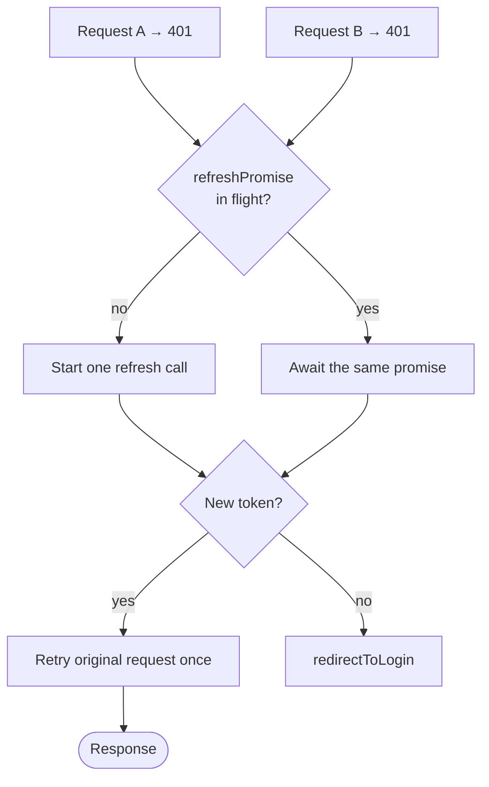
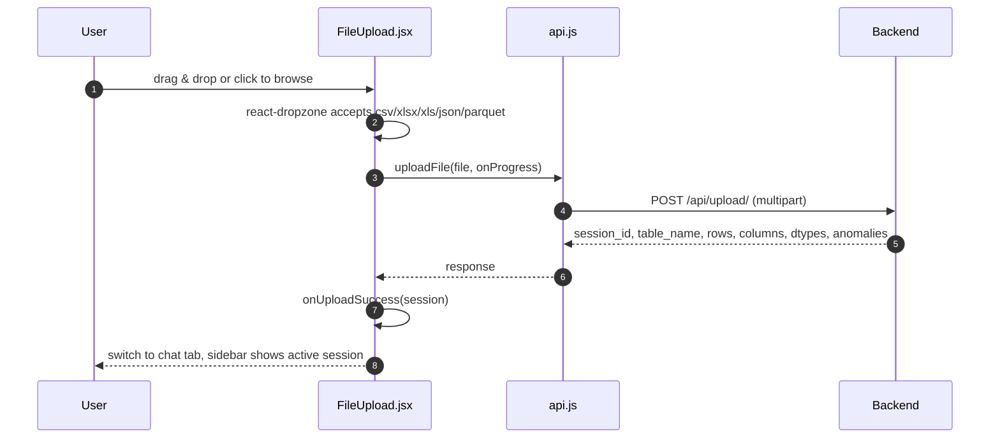
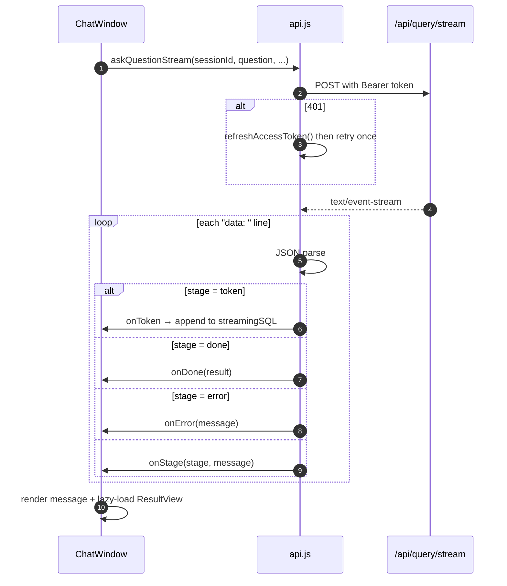

# Frontend Application Workflow

How the React app boots, decides whether you are logged in, streams an answer, and draws it. Everything here lives under `frontend/src/`.

Related: [[01 Complete System Workflow]] for the backend half, [[03 System Architecture Flow]] for where this sits in the deployment, [[04 Data Flow Diagram]] for what the browser is allowed to hold.

## Component tree

`ResultView` is the only lazily loaded component — it pulls in all of Recharts, so it stays out of the initial bundle until an answer actually needs a chart.

## Boot sequence

> [!important] Why there is a booting state
> The access token lives in **memory only**, so a page reload starts with nothing. Without a boot step, a logged-in user would flash the login screen on every refresh. `App.jsx` therefore renders a `role="status"` placeholder until `bootstrapSession()` resolves.

The 401 you see in devtools on a cold load is this call, and it is expected — not a bug.

## Token handling

`frontend/src/services/api.js` is the single place that knows about credentials.

| Thing | Where it lives | Why |
|---|---|---|
| Access token | Module-scope variable | XSS cannot read it from storage; it dies with the tab |
| Role | Module-scope variable | Same |
| Refresh token | `httpOnly` cookie, sent only to `/api/auth/*` | JavaScript never sees it |

> [!warning] Nothing token-shaped goes in `localStorage`
> This was a deliberate change (issue #22). If you add a feature that "just needs to remember the user", use the refresh cookie path — do not reintroduce storage.

### Refresh coordination

A single in-flight `refreshPromise` is shared by every caller, so ten parallel 401s produce **one** refresh, not ten. Each request is retried at most once — the `_retried` flag on the axios config prevents a refresh loop.

## Dashboard and routing

- Routes are `/login`, `/signup`, and `/*` → `Dashboard`. Authenticated users hitting `/login` are redirected home, and unauthenticated users hitting anything else are redirected to `/login`.
- Inside the dashboard, navigation is **tab state, not routes**: `upload`, `chat`, `audit`, `admin` (owners/admins only), `account`.
- Returning from Stripe Checkout carries a `?status=` marker, and the dashboard opens on the billing view instead of the default tab.
- `session` state holds the uploaded dataset descriptor. Until it exists, the chat tab shows **"No data loaded — upload a file first"**.

## Upload flow in the browser

Upload progress is reported through an axios `onUploadProgress` callback, so a 400 MB file shows a real percentage rather than a spinner.

## Ask flow and SSE consumption

`ChatWindow.jsx` calls `askQuestionStream()` with six callbacks: `onStage`, `onDone`, `onError`, `onToken`.

Notes that matter when editing this code:

- The reader keeps a `buffer` and splits on `\n`, holding back the last partial line. A chunk boundary in the middle of a JSON payload will not corrupt parsing.
- A malformed SSE line is **ignored**, not thrown — one bad frame must not kill the stream.
- `STAGE_LABELS` maps the backend `stage` string to the human sentence shown while waiting. If you add a stage in `query.py`, add it here or the UI shows nothing for it.
- Tokens are appended to `streamingSQL` so the user watches the SQL being typed out live.

## Rendering the answer

`ResultView.jsx` receives the result envelope and offers a chart-type switcher — the backend's `recommend_chart_type()` picks the default, the user can override it.

| Switcher key | Recharts component |
|---|---|
| `bar` | `BarChart` |
| `line` | `LineChart` |
| `area` | `AreaChart` |
| `pie` | `PieChart` |
| `scatter` | `ScatterChart` |
| `multi_series` | grouped `BarChart` |
| `table` | sortable HTML table |

A `single_value` result renders as one large number instead of a chart. **Export PDF** posts the session to `/api/export` and downloads a board-ready report.

## Dev-time proxy

`frontend/vite.config.js` proxies `/api` and `/health` to `http://localhost:8000`, so the SPA and API share an origin in development exactly as they do behind nginx in production.

> [!tip] Split-origin setups
> `API_BASE` defaults to same-origin `/api`. Set `VITE_API_URL=http://localhost:8000/api` only when the frontend is served from a different origin than the backend — the default is what avoids the old hardcoded-https mixed-content bug.

## Error handling and quality gates

- `ErrorBoundary` wraps the entire route tree, so a render crash shows a recovery screen instead of a white page.
- Vitest coverage thresholds are enforced in `vite.config.js`: **91 statements / 94 branches / 71 functions / 91 lines**. They sit just under the measured values on purpose — a gate with wide headroom does not bite, and one that does not bite is decoration.
- Playwright owns `e2e/` and is excluded from the Vitest run.
