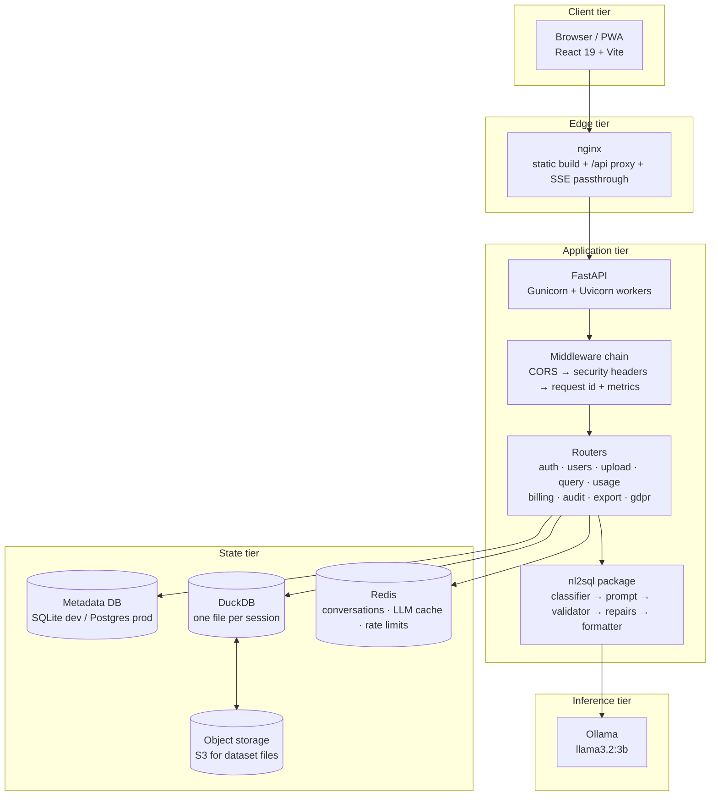
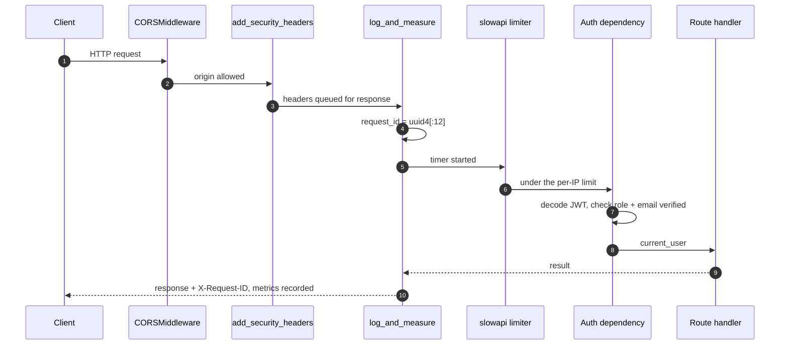
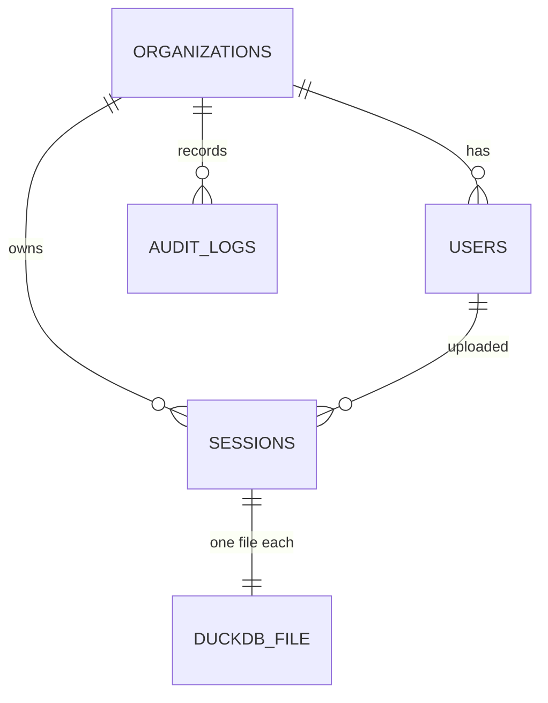
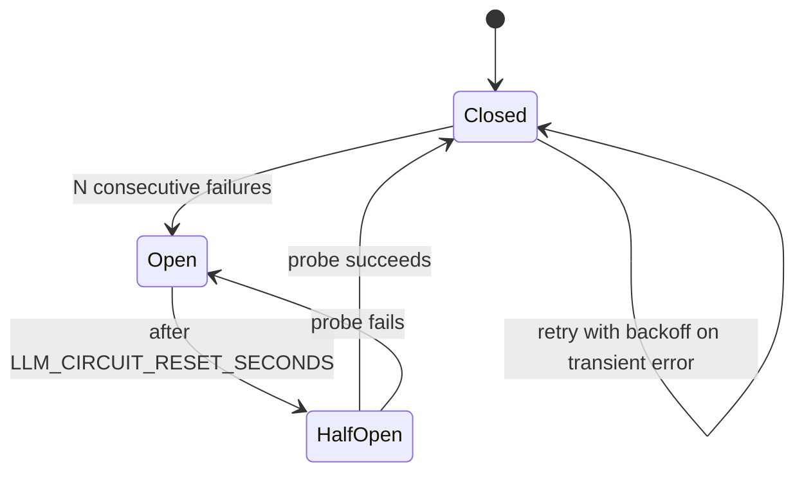
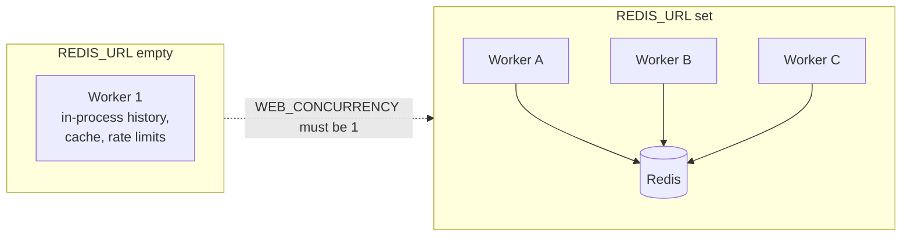
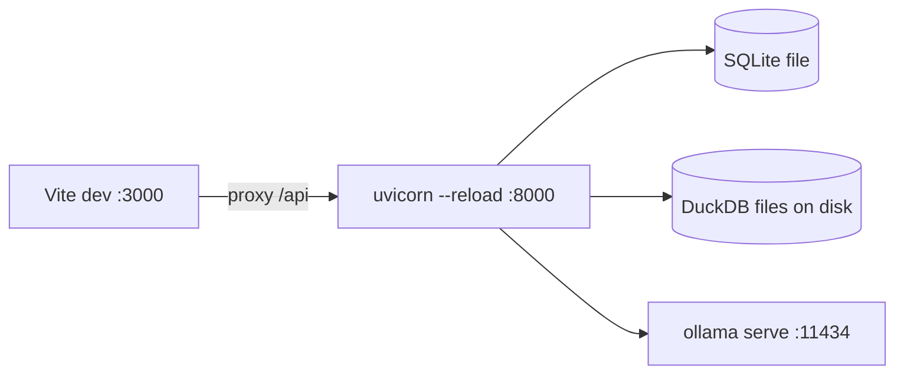

# System Architecture Flow

The components DataWhisper is made of, how a request moves through them, and what changes between a laptop and a Kubernetes cluster.

Visual board: `System Architecture.canvas`
Related: [[01 Complete System Workflow]] · [[04 Data Flow Diagram]] · [[02 Frontend Application Workflow]]

## Layered view

## What each tier is responsible for

> [!info] Client
> React 19 SPA. Holds the access token in memory, consumes SSE with `fetch` + a manual reader, lazily loads Recharts. See [[02 Frontend Application Workflow]].

> [!info] Edge
> In production nginx serves the static Vite build and reverse-proxies `/api`, including **SSE passthrough** — buffering must stay off or the streaming stages arrive all at once. In development Vite's own proxy plays the same role.

> [!info] Application
> FastAPI. Every request passes the same middleware chain, every route is prefixed under `/api`, and `/health/live`, `/health/ready`, `/metrics` sit outside it.

> [!info] State
> Four distinct stores with different lifetimes and blast radius — this split is the core of the design, and [[04 Data Flow Diagram]] covers the rules.

> [!info] Inference
> Ollama, reached over HTTP at `OLLAMA_BASE_URL`. Nothing else in the system talks to a model.

## Request path through the middleware chain

> [!warning] Order is load-bearing
> Security headers are applied to the response on the way out, and the metrics label uses the **matched route template** rather than the raw URL — labelling by raw path would give Prometheus unbounded cardinality, one series per session id.

## Authorization model

Every user, session, and audit row carries an `org_id`. An authorization check requires **both** ownership/role **and** a matching org, which is what isolates tenants.

| Role | Can do |
|---|---|
| `owner` | Everything in the org, including billing and deletion of the organization |
| `admin` | Manage users, read audit logs |
| `member` | Upload, query, export, manage own account |

> [!important] 404, not 403
> `_authorize()` in `query.py` raises **404** when a caller does not own a session. A 403 would confirm the session exists, which turns the endpoint into an id oracle.

## Reliability around the model

- **Bounded concurrency** — `LLM_MAX_CONCURRENCY` semaphore, so a burst of users queues instead of overwhelming one model server.
- **Retry** — `LLM_RETRY_ATTEMPTS` with exponential backoff.
- **Circuit breaker** — after `LLM_CIRCUIT_FAIL_THRESHOLD` consecutive failures, calls fail fast for `LLM_CIRCUIT_RESET_SECONDS`, so a dead Ollama does not tie up every worker.
- **Cache** — identical prompts reuse a prior response. Safe because temperature is 0.1 and the prompt fully encodes schema + history + question. Keyed by `hash(model + prompt)`, so changing `LLM_MODEL` invalidates it.

## Scaling: what shared state unlocks

`build_conversation_store()` and `build_llm_cache()` pick their backend from `REDIS_URL` alone — swapping is pure configuration, every call site is unchanged.

> [!danger] REQUIRE_SHARED_STATE
> Set `true` on any deployment that can run more than one worker or replica. The process then **refuses to start** without `REDIS_URL` instead of silently falling back to per-pod conversation history and per-pod rate limits — which look fine in staging and lose a user's follow-up question in production.

## Deployment topologies

### Local development

Single worker, in-process state, `DEBUG=true`, `/docs` exposed.

### Docker Compose

Defined in `docker-compose.yml` — five services on one network:

| Service | Image / build | Port | Notes |
|---|---|---|---|
| `frontend` | `./frontend` | `8080:80` | nginx serving the production build |
| `backend` | `./backend` | `expose 8000` | Gunicorn/Uvicorn, not `--reload` |
| `ollama` | `ollama/ollama:latest` | `11434` | models in the `ollama_models` volume |
| `redis` | `redis:7-alpine` | internal | `allkeys-lru`, 256 MB, no persistence |
| `postgres` | `postgres:16-alpine` | internal | `postgres_data` volume |

The backend waits on `redis` and `postgres` **health**, not merely start, and reaches every dependency by service name.

### Kubernetes

Manifests in `deploy/k8s`, managed infra in `deploy/terraform`:

- backend Deployment with **2+ replicas**, HPA **2–10**, and a PodDisruptionBudget
- health-gated rollout using `/health/live` and `/health/ready`
- a migration `Job` that runs before the new version takes traffic
- ingress configured for **SSE** (no response buffering)
- `backup-cronjob.yaml` for the scheduled backups behind the RPO ≤ 15 min / RTO ≤ 1 hr targets in `docs/DISASTER_RECOVERY.md`

## Configuration fail-fast

At startup `lifespan` runs `init_db()`, `check_limits_are_reachable()`, and `check_shared_state()`. With `DEBUG=false` the app **refuses to start** when:

- `SECRET_KEY` is unset, default, or weak — a known signing key means forgeable admin tokens
- `ALLOWED_ORIGINS` is `*`
- `REQUIRE_SHARED_STATE=true` but `REDIS_URL` is empty

> [!tip] This is a feature
> A boot that fails loudly on a laptop is cheaper than a deployment that silently accepts forged tokens.
