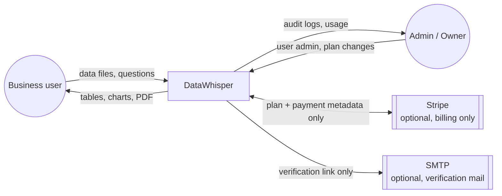
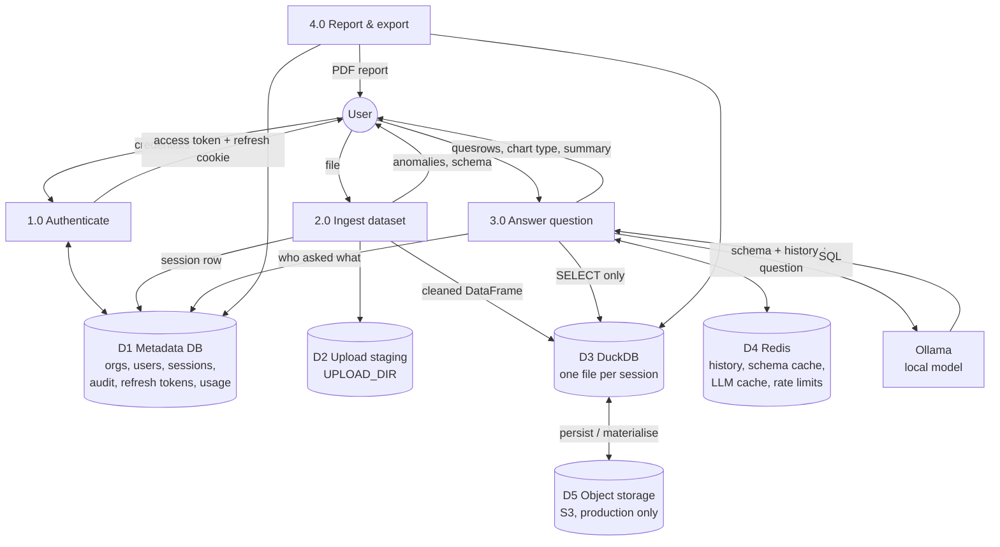
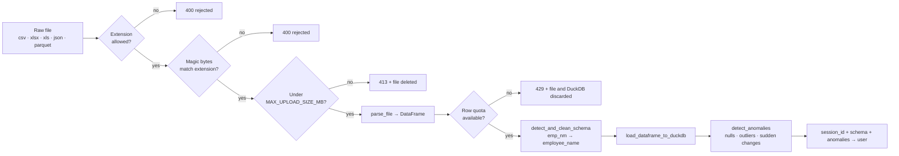
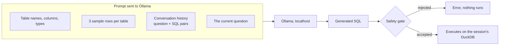
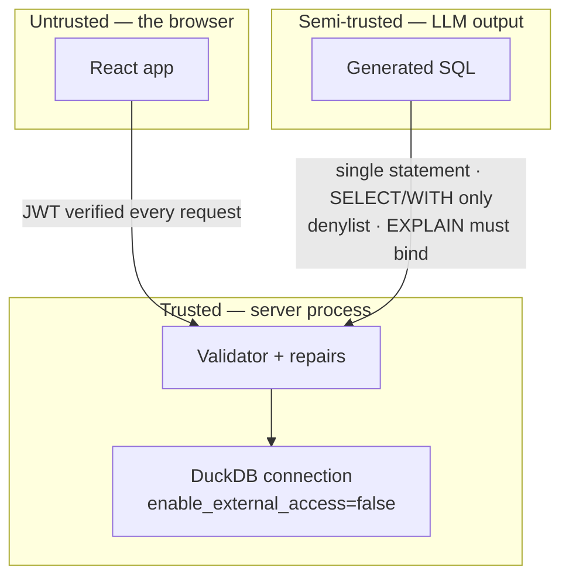
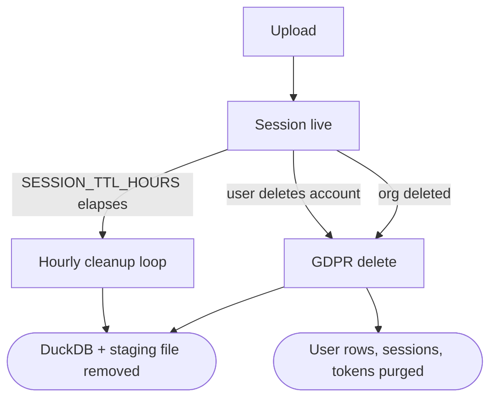

# Data Flow Diagram

Where data enters, where it is stored, who may read it, and where it is destroyed. DataWhisper's central claim is that **nothing leaves the machine** — this note is the audit of that claim.

Visual board: `Data Flow.canvas`
Related: [[03 System Architecture Flow]] · [[01 Complete System Workflow]]

## Level 0 — context diagram

> [!important] The only two outbound paths
> Stripe and SMTP. **Neither ever carries uploaded data or question text** — Stripe sees plan and customer metadata, SMTP sees an address and a token. With `STRIPE_SECRET_KEY` empty the billing routes return 503 and the integration is inert. The LLM is local, so prompts never cross the network boundary.

## Level 1 — processes and stores

## The five stores

| Store | Contains | Lifetime | Scope |
|---|---|---|---|
| **D1** Metadata DB | orgs, users, sessions, audit log, refresh tokens, usage counters | Permanent until deleted | Per org |
| **D2** Upload staging | the raw uploaded file | Deleted immediately on any ingestion failure | Per session |
| **D3** DuckDB | the parsed dataset, one file per `session_id` | `SESSION_TTL_HOURS`, default 24 | Per session |
| **D4** Redis | conversation history, cached schema, cached LLM responses, rate-limit counters | `CONVERSATION_TTL_MINUTES` (120) / cache TTL | Per session, per IP |
| **D5** Object storage | the DuckDB file, when `dataset_storage` is S3 | Same as the session | Per session |

> [!note] Why DuckDB is per session and not one shared database
> Isolation is structural rather than enforced by query text. A session's SQL runs against a connection that can only see that session's file, so a prompt-injected query has nothing else to reach.

## Transformations along the ingestion path

Every rejection path deletes what it created. A failed upload leaves no file, no DuckDB, and no consumed quota.

## What reaches the model

> [!question] Does my data go into the prompt?
> Some of it does — and it stays on the machine. `get_schema_info()` sends **column names, column types, and three sample rows per table**. Sample rows are what let a small model produce correct SQL; without them it guesses at value formats. The prompt travels to `OLLAMA_BASE_URL`, which is local, so this never crosses a network boundary you do not control.

Full results are **never** sent to the model. Only the schema, the samples, and the question shape the prompt.

## Trust boundaries

> [!danger] Treat generated SQL as hostile input
> It is written by a model that just read user-controlled text. Two independent controls apply:
> 1. **`enable_external_access=false`** on every query connection — file and URL access is blocked by the database itself. This is the primary control.
> 2. **The validator** — one statement, `SELECT`/`WITH` only, denylist for DDL/DML and file-reading table functions, and a binding `EXPLAIN`.
>
> The self-heal path re-runs both. A denylist alone would be brittle; the connection-level lockdown is what makes the guarantee hold.

## Prompt injection

Injection patterns are matched **before any data signal**, in `classify_intent()`. A question containing "ignore previous instructions" is classified `off_topic` and never reaches prompt construction — the check is not a filter applied to the model's output, it is a gate in front of the model.

## Retention and deletion

- A background loop runs **hourly**: `cleanup_stale_sessions()` and `purge_expired_refresh_tokens()`.
- Conversation history expires after `CONVERSATION_TTL_MINUTES` independently of the dataset.
- `GET /api/me/export` returns a user's data; `DELETE /api/me` and `DELETE /api/org` remove it. These are the GDPR routes in `backend/app/api/routes/gdpr.py`.

## Audit trail

Every query writes one row: **user, org, session, question, the SQL that ran, the summary, the outcome**. Entries are **hash-chained** — each row's hash covers the previous one, and a checkpoint signature covers the run — so a deleted or edited row breaks the chain and is detectable. Only admins and owners can read the log, and only within their own org.

## Privacy claim, restated precisely

> [!success] What "100% offline" means here
> - The model runs locally; **prompts and results never leave the host**.
> - Uploaded data reaches disk, DuckDB, and — in production only — your own object storage.
> - The only outbound calls are Stripe and SMTP, both optional, and neither carries dataset content or question text.
> - With `STRIPE_SECRET_KEY` and the mailer unset, the process makes **no outbound connections at all** beyond `OLLAMA_BASE_URL`.
